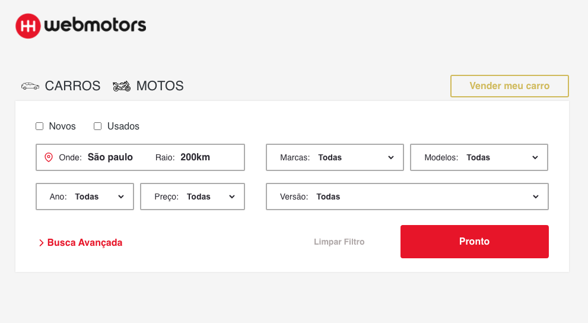

## Teste Web-Motors 

**Notas: Esse projeto constitui por um fronend seguindo aos pedidos solicitado**


# Tecnologias Utilizadas 🚀
React JS ⚛️ <br />
Styled-Components 💅🏻 <br />
Jest 🧪  <br />
React Icons ⚡️ <br />
Typescript 🖥

🚀 - Para executar o projeto execute o seguinte comando:

```js
    yarn start ou npm start 🥊
```

# Foi disponibilizado um test

🚀 - Para executar o test execute o seguinte comando:

```js
    yarn test ou npm test 🥊
```

# Imagens 
<p align="center">
  
</p>


